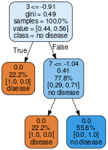

# Heart-Disease-UCI
The project is based upon the **kaggle dataset of Heart Disease UCI**.

# About
There are a total of 14 columns, the columns are described as followed:
- age
- sex
- chest pain type (4 values)
- resting blood pressure
- serum cholestoral in mg/dl
- fasting blood sugar > 120 mg/dl
- resting electrocardiographic results (values 0,1,2)
- maximum heart rate achieved
- exercise induced angina
- oldpeak = ST depression induced by exercise relative to rest
- the slope of the peak exercise ST segment
- number of major vessels (0-3) colored by flourosopy
- thal: 3 = normal; 6 = fixed defect; 7 = reversable defect
- target, i.e. whether the patient has heart diseases or not [0 for patient who has heart diseases & 1 for no heart diseases]

# My Work
I have tried the work in four different machine learning models, i.e. 
- DecisionTreeClassifier
- RandomForestClassifier
- LogisticRegression
- XGBClassifier

Among them RandomForestClassifier & LogisticRegression showed good cross validation accuracy and the standard deviations also less as compare to other two, and after further research I choose RandomForestClassifier as my final model. The hyper-parameters I used in the final model is:
```
final_model = RandomForestClassifier(n_estimators=60, random_state=9, 
                                     criterion='gini', max_features='sqrt',
                                     max_samples=9)
```

# Architechture Of Final Tree
The tree generated by the final model looks like:


# Ouput
- The Classification Report is as followed:
```
                    Classification Report :
                                  precision    recall  f1-score   support

                               0       0.89      0.86      0.88        29
                               1       0.88      0.91      0.89        32

                        accuracy                           0.89        61
                       macro avg       0.89      0.88      0.88        61
                    weighted avg       0.89      0.89      0.89        61
```
I have mentioned the *Training Accuracy*, *Testing Accuracy*, *Sensitivity*, *Specificity* and *The AUC Score* in the ```.ipynb``` file!
